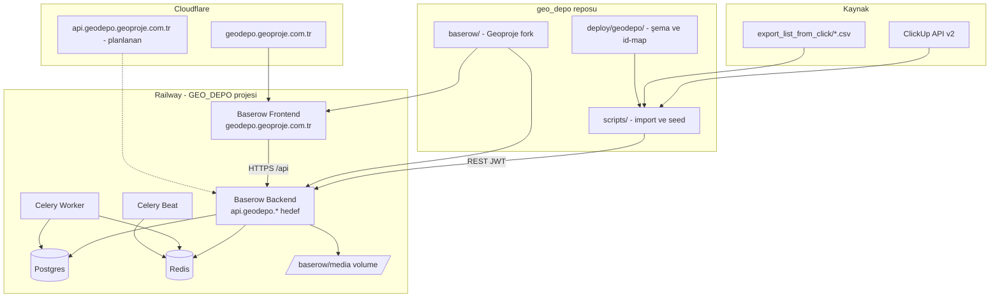
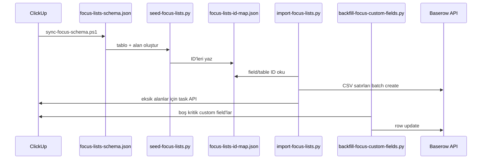

# GEO DEPO — Proje Notu

**Son güncelleme:** 29 Haziran 2026  
**Kapsam:** ClickUp (GEOPROJE → LİSTELER) verilerinin Baserow tabanlı **Geoproje** platformuna taşınması

---

## 1. Proje amacı

GEO DEPO, Geoproje operasyon verilerini ClickUp bağımlılığından çıkarıp şirket içi, özelleştirilebilir ve sürdürülebilir bir veri platformuna taşımayı hedefler. İlk odak üç kritik liste üzerindedir:

| ClickUp listesi | Baserow tablosu | Table ID |
|-----------------|-----------------|----------|
| Teklif | Teklif | 27 |
| Devam Eden İşler | Devam Eden İşler | 29 |
| Ödeme Takibi | Ödeme Takibi | 30 |

**Workspace:** GEO_DEPO Ana (ID: 2)  
**Veritabanı:** Operasyonlar v2 (ID: 11) — eski `Operasyonlar` (ID: 7) kullanılmamalıdır.

**Production URL:** https://geodepo.geoproje.com.tr

---

## 2. Mimari genel bakış



### Katmanlar

| Katman | Teknoloji | Rol |
|--------|-----------|-----|
| Uygulama | Baserow OSS (Django + Nuxt 3) | Tablo, görünüm, API, otomasyon altyapısı |
| Marka | Geoproje fork | Premium/Enterprise kaldırıldı, marka Geoproje |
| Veri | PostgreSQL | İlişkisel depo |
| Kuyruk | Redis + Celery | Arka plan işleri, periyodik görevler |
| Medya | Railway volume `/baserow/media` | Dosya ekleri |
| Dağıtım | Railway (Dockerfile build) | Kaynak koddan build, hazır imaj değil |
| DNS | Cloudflare | Custom domain, TLS |
| E-posta | Dalnet SMTP | Davet, şifre sıfırlama |
| Entegrasyon | ClickUp API v2 | Şema ve eksik alan backfill |
| Script | Python 3 + PowerShell | Import, seed, Railway yönetimi |

---

## 3. Neden bu teknolojiler?

### 3.1 Baserow OSS (fork: Geoproje)

**Tercih nedeni:**
- Airtable/ClickUp benzeri tablo + görünüm + API modeli operasyon verisine uygun
- Self-hosted: veri Türkiye/şirket kontrolünde kalır
- REST API ile toplu import ve ileride otomasyon mümkün
- Kanban, grid, ilişkisel alanlar (link row) ClickUp iş akışını karşılar

**Fork kararları (`scripts/customize-geoproje.ps1`):**
- `premium` ve `enterprise` dizinleri kaldırıldı → build süresi ve karmaşıklık azaldı
- `BASEROW_OSS_ONLY=true` varsayılan → lisans ve modül karmaşası yok
- Marka Baserow → Geoproje (başlık, locale, logo linkleri)
- Railway Dockerfile’ları OSS-only için üretiliyor

### 3.2 Railway (hazır imaj yerine kaynak koddan build)

**Tercih nedeni:**
- `baserow/` fork’undaki özelleştirmelerin production’a yansıması gerekir
- Railway Metal builder BuildKit bind mount desteklemez → `generate-railway-dockerfiles.ps1` ile uyumlu Dockerfile üretimi
- Postgres, Redis, volume, internal networking tek projede

**Servis ayrımı (dağıtık mimari):**

| Servis | Config | Healthcheck |
|--------|--------|-------------|
| Baserow Backend | `deploy/railway/backend.toml` | `/api/_health/` |
| Baserow Frontend | `deploy/railway/frontend.toml` | `/_health/` |
| Celery Worker | `deploy/railway/celery-worker.toml` | — |
| Celery Beat | `deploy/railway/celery-beat.toml` | — |

**Internal URL:** `PRIVATE_BACKEND_URL=http://baserow-backend.railway.internal:8080`  
**Public URL’ler ayrı tutulur** — frontend SSR ve tarayıcı farklı URL’ler kullanır.

### 3.3 Custom domain: frontend + API alt alanı

**Tercih nedeni:**
- `geodepo.geoproje.com.tr` kullanıcıya tanıdık adres
- Frontend (`geodepo.*`) ile backend (`*.up.railway.app`) farklı origin → cookie, CORS ve tarayıcı güvenilirliği sorunları
- **Hedef mimari:** `PUBLIC_WEB_FRONTEND_URL=https://geodepo.geoproje.com.tr`, `PUBLIC_BACKEND_URL=https://api.geodepo.geoproje.com.tr`
- Aynı üst domain (`geoproje.com.tr`) → session cookie ve dosya indirme (`secure_file_serve`) düzgün çalışır

**DNS (Cloudflare — kullanıcı tarafında):**
- `geodepo` → Railway frontend (mevcut)
- `api.geodepo` CNAME → `ddci0yft.up.railway.app` (Railway’de tanımlandı, DNS bekleniyor)
- `_railway-verify.api.geodepo` TXT → Railway doğrulama

DNS sonrası: `scripts/configure-geodepo-api-domain.ps1`

### 3.4 Python import scriptleri (PowerShell yerine ağır işler için)

**Tercih nedeni:**
- PowerShell’de UTF-8/Türkçe karakter ve `ExecutionPolicy` sorunları yaşandı
- CSV 800+ satır, batch API, retry mantığı Python’da daha güvenilir
- `unicodedata.normalize("NFC")` ile Türkçe alan adları tutarlı

**PowerShell kaldığı yerler:**
- Railway CLI otomasyonu
- ClickUp şema çekme (`sync-focus-schema.ps1` — curl + UTF-8 temp dosya)
- Ortak API helper: `scripts/lib/geodepo-api.ps1`

### 3.5 İki aşamalı veri modeli: şema JSON + id-map

**Tercih nedeni:**
- Tekrarlanabilir seed: aynı şema farklı ortama uygulanabilir
- ClickUp alan ID’leri ile Baserow field ID’leri `focus-lists-id-map.json`’da eşlenir
- Import scriptleri id-map’e bakarak güncelleme/yeniden çalıştırma yapabilir (idempotent yaklaşım)

**Dosya hiyerarşisi:**

```
deploy/geodepo/
├── focus-lists-config.json    # Türkçe isimler, görünümler, liste meta
├── focus-lists-schema.json    # 130 alan, Baserow field tipleri
├── focus-lists-id-map.json    # workspace/table/field ID eşlemesi
├── focus-import-log.json      # import özeti
├── focus-backfill-log.json    # API backfill özeti
└── PROJE_NOTU.md              # bu dosya
```

### 3.6 CSV + API hibrit import

**Tercih nedeni:**
- ClickUp CSV export: toplu satır, hızlı ilk yükleme
- ClickUp Task API: CSV’de eksik kalan custom field’lar (Ödeme Takibi’nde sayfalama limiti)
- `backfill-focus-custom-fields.py` yalnızca boş kritik alanları API’den doldurur

**Alan tipi dönüşümleri (bilinçli kararlar):**
- ClickUp `labels` → Baserow `text` (BELEDİYE, İşveren gibi çoklu etiketler)
- Geçersiz status (`to do` vb.) atlandı — Baserow single_select seçenekleriyle uyumsuz
- `Kayıt Türü`: Proje / Alt Görev / Ödeme Taksiti — parent ilişkisini modellemek için

---

## 4. Şimdiye kadar yapılanlar

### Faz A — Platform kurulumu

1. Baserow kaynak kodu repoya alındı (`baserow/`)
2. Geoproje fork uygulandı (OSS-only, marka)
3. Railway’de dağıtık servisler: Backend, Frontend, Celery Worker/Beat, Postgres, Redis
4. Dalnet SMTP yapılandırıldı (`noreply@geoproje.com.tr`)
5. Backend media volume bağlandı
6. GitHub → Railway kaynak build pipeline (`apply-railway-source-config.ps1`)

### Faz B — İlk ClickUp analizi (geniş kapsam)

- `analyze-clickup.ps1` → tüm GEOPROJE space yapısı
- `sync-clickup-schema.ps1` / `seed-geodepo-workspace.ps1` → eski Operasyonlar DB (ID: 7)
- Bu faz öğretici oldu; odak listeler için v2 modeline geçildi

### Faz C — Odak listeler (Operasyonlar v2)

| Adım | Script | Sonuç |
|------|--------|-------|
| Şema üretimi | `sync-focus-schema.ps1` | 130 custom field, 3 tablo şeması |
| Tablo/alan seed | `seed-focus-lists.py` | Teklif, Devam Eden, Ödeme + typed field’lar |
| CSV import | `import-focus-lists.py` | Teklif 18, Devam Eden 62 (+34 parent), Ödeme 833 (+419 parent) |
| Custom field backfill | `backfill-focus-custom-fields.py` | 773 aday, 738 güncellendi |
| Takılı job temizliği | API üzerinden | DB 7’deki pending `file_import` job iptal |

### Faz D — Production domain

1. `PUBLIC_WEB_FRONTEND_URL=https://geodepo.geoproje.com.tr`
2. `BASEROW_EXTRA_PUBLIC_URLS` → Railway fallback URL
3. `BASEROW_DISABLE_PUBLIC_URL_CHECK=true`
4. `MEDIA_URL` backend + frontend’e eklendi
5. `api.geodepo.geoproje.com.tr` Railway backend domain olarak kayıtlı (DNS bekliyor)

### Faz E — Keşifler (yapılmadı / sınırlı)

- ClickUp **automation** listesi API’de yok (404); yalnızca 1 adet **suspended** Make.com webhook bulundu (`listUpdated`, LİSTELER klasörü)
- Automation’lar Baserow Automation ile yeniden tasarlanmalı — otomatik taşıma mümkün değil

---

## 5. Veri modeli kararları

### Ortak sistem alanları (her tabloda)

| Alan | Amaç |
|------|------|
| ClickUp Task ID | Geri izlenebilirlik, incremental sync |
| ClickUp Task Link | Orijinal göreve hızlı erişim |
| ClickUp Liste | Kaynak liste |
| Diğer Listeler | ClickUp `other_locations` |
| ClickUp Parent ID | Hiyerarşi |
| Üst Görev | Baserow link_row (Devam Eden, Ödeme) |
| Kayıt Türü | Proje / Alt Görev / Ödeme Taksiti ayrımı |

### Görünümler

- **Tümü** (grid) — tam veri
- **Kanban** — `Durum` alanına göre

### İlişki modeli

```
Teklif (bağımsız)
    └── Devam Eden İşler (parent_link → üst görev / proje)
            └── Ödeme Takibi (parent_link → devam eden iş)
```

Bu yapı ClickUp’taki çoklu liste konumlarını ve ödeme taksitlerini Baserow’da normalize eder.

---

## 6. Import pipeline (tekrar çalıştırma)



**Ortam değişkenleri (`.env`):**

```env
GEODEPO_BASEROW_URL=https://baserow-backend-production-4412.up.railway.app
GEODEPO_BASEROW_EMAIL=...
GEODEPO_BASEROW_PASSWORD=...
CLICKUP_API_TOKEN=pk_...
```

**Çalıştırma sırası:**

```powershell
# 1) Şema (ClickUp'tan)
.\scripts\sync-focus-schema.ps1

# 2) Seed (tablolar + alanlar)
python scripts/seed-focus-lists.py

# 3) Import (CSV + API)
python scripts/import-focus-lists.py

# 4) Backfill (isteğe bağlı, Ödeme için)
python scripts/backfill-focus-custom-fields.py
```

---

## 7. Production ortam değişkenleri (referans)

### Backend

| Değişken | Değer / not |
|----------|-------------|
| `PUBLIC_WEB_FRONTEND_URL` | `https://geodepo.geoproje.com.tr` |
| `PUBLIC_BACKEND_URL` | Railway backend URL (hedef: `https://api.geodepo.geoproje.com.tr`) |
| `MEDIA_URL` | `{PUBLIC_BACKEND_URL}/media/` |
| `BASEROW_EXTRA_ALLOWED_HOSTS` | frontend + backend + custom domain hostları |
| `BASEROW_ENABLE_SECURE_PROXY_SSL_HEADER` | `true` |
| `BASEROW_OSS_ONLY` | `true` |
| `EMAIL_SMTP_*` | Dalnet kurumsal mail |

### Frontend

| Değişken | Değer / not |
|----------|-------------|
| `PUBLIC_BACKEND_URL` | Backend public URL (tarayıcı API çağrıları) |
| `PUBLIC_WEB_FRONTEND_URL` | Custom domain |
| `BASEROW_DISABLE_PUBLIC_URL_CHECK` | `true` (custom domain için) |
| `BASEROW_EXTRA_PUBLIC_URLS` | Railway fallback URL |
| `MEDIA_URL` | Backend media URL |

**Kritik:** `PUBLIC_BACKEND_URL` asla yalnızca frontend domain’ine ayarlanmamalı — `/api` frontend’de yok (404).

---

## 8. Applications MVP (Operasyon + Sistem + Kokpit)

Kurulum scripti: `scripts/setup-geodepo-mvp.py`  
Config: `deploy/geodepo/applications-config.json`

| Katman | Uygulama | ID | URL / not |
|--------|----------|-----|-----------|
| Operasyon | Ödeme Girişi (form) | view **40**, tablo **30** | `/database/11/table/30/40` |
| Sistem | GEO DEPO Sistem → Teklif Kabul → Proje | automation **13**, workflow **4** | **live** (29 Haz 2026) |
| Kokpit | GEO DEPO Kokpit | dashboard **14** | 3 özet widget (count) |

**Automation akışı:** Teklif tablosunda (27) `Teklif Durumu = Kabul Edildi` → Devam Eden İşler (29) satırı oluşturur (`Kayıt Türü=Proje`, `ClickUp Task ID=teklif-{id}`).

**Celery notu:** Publish/import job'ları `export` kuyruğuna gider. Worker yalnızca `celery` dinliyorsa job'lar `pending` kalır. Çözüm: `scripts/configure-geodepo-celery-worker.ps1` (`BASEROW_RUN_MINIMAL=true`, `BASEROW_AMOUNT_OF_WORKERS=1`).

---

## 9. Bilinen sorunlar ve açık işler

| Konu | Durum | Önerilen çözüm |
|------|-------|----------------|
| API cross-origin | `api.geodepo.geoproje.com.tr` Railway'de tanımlı | Cloudflare DNS yayılımı; `configure-geodepo-api-domain.ps1` |
| Giriş sorunları | API çalışıyor; ara sıra Railway timeout | API alt domain; tarayıcı cache temizliği |
| Celery export kuyruğu | Düzeltildi (29 Haz) | Worker combined mode; `configure-geodepo-celery-worker.ps1` |
| Dashboard Proje filtresi | `Kayıt Türü=Proje` filtresi API 400 | Widget şimdilik tüm satırları sayıyor |
| ClickUp automation | API yok, envanter yok | ClickUp UI’dan manuel liste → Baserow Automation ile yeniden kur |
| Eski DB (ID: 7) | Karışıklık riski | Yalnızca Operasyonlar v2 (ID: 11) kullan |
| Make.com webhook | Suspended (2023) | İhtiyaç varsa Baserow webhook/automation ile değiştir |

---

## 10. Gelecek geliştirmeler için mimari kurallar

### Yapılması gerekenler

1. **Tüm veri değişiklikleri API üzerinden** — UI’da manuel düzenleme yerine script + log dosyası (`deploy/geodepo/*-log.json`)
2. **Şema önce JSON’da** — `focus-lists-schema.json` / `focus-lists-config.json` güncelle, sonra seed
3. **ID-map’i koru** — yeni alan/tablo eklendiğinde `focus-lists-id-map.json` güncellenmeli
4. **UTF-8 NFC** — Türkçe alan adlarında normalization zorunlu
5. **Batch + retry** — Baserow/ClickUp API rate limit ve timeout için (import scriptlerindeki pattern)
6. **OSS-only uyumluluk** — Premium/Enterprise API’leri kullanma; fork ile uyumlu kal
7. **Railway deploy** — `baserow/` değişikliklerinden sonra ilgili servisi redeploy et
8. **Secret yönetimi** — token/şifre yalnızca `.env` ve Railway variables; repoya commit yok
9. **Incremental sync** — `ClickUp Task ID` üzerinden upsert; tam re-import son çare
10. **Otomasyon** — Baserow Automation (OSS’te mevcut workflow node’ları); ClickUp automation kopyalanamaz, yeniden tasarlanır

### Yapılmaması gerekenler

- Hazır Baserow Docker imajına geçmek (fork özelleştirmeleri kaybolur)
- `Operasyonlar` (DB 7) üzerinde yeni iş yapmak
- Frontend’i backend URL sanarak `PUBLIC_BACKEND_URL` ayarlamak
- PowerShell ile büyük CSV import (encoding riski)
- ClickUp automation’larını “otomatik migrate ederiz” varsayımı

### Önerilen teknoloji seçimi (yeni özellikler)

| İhtiyaç | Teknoloji |
|---------|-----------|
| Toplu veri / ETL | Python 3 (`urllib` veya `httpx`), JSON config |
| Altyapı / deploy | Railway CLI, PowerShell scriptleri |
| UI özelleştirme | Nuxt 3 / Vue (web-frontend), Django (backend) |
| Periyodik sync | Celery Beat + management command veya harici cron → API script |
| Dış entegrasyon | Baserow webhook veya Automation HTTP node |
| Dosya/medya | Backend `MEDIA_URL` + volume; CDN opsiyonel |
| Auth | Baserow JWT; ileride SSO ayrı karar |

---

## 11. Script ve dosya rehberi

| Dosya | Görev |
|-------|-------|
| `scripts/setup-geodepo-mvp.py` | Operasyon formu + automation + dashboard MVP |
| `scripts/configure-geodepo-celery-worker.ps1` | Celery Worker export kuyruğu (publish/import) |
| `scripts/customize-geoproje.ps1` | Baserow → Geoproje fork |
| `scripts/generate-railway-dockerfiles.ps1` | Railway uyumlu Dockerfile |
| `scripts/setup-railway-source-build.ps1` | İlk Railway env kurulumu |
| `scripts/configure-geodepo-api-domain.ps1` | API alt domain env güncelleme |
| `scripts/configure-dalnet-smtp-railway.ps1` | SMTP ayarları |
| `scripts/sync-focus-schema.ps1` | ClickUp → schema JSON |
| `scripts/seed-focus-lists.py` | Baserow tablo/alan oluşturma |
| `scripts/import-focus-lists.py` | CSV + API import |
| `scripts/backfill-focus-custom-fields.py` | Eksik custom field doldurma |
| `scripts/lib/geodepo-api.ps1` | PowerShell REST helper |
| `export_list_from_click/*.csv` | ClickUp CSV export kaynağı |

---

## 12. Özet

GEO DEPO, ClickUp operasyon verisini **Geoproje markalı Baserow OSS** üzerine taşıyan bir self-hosted veri platformudur. Mimari bilinçli olarak **kaynak koddan Railway build**, **JSON-driven şema**, **Python ETL** ve **custom domain** üzerine kurulmuştur. İlk fazda Teklif / Devam Eden İşler / Ödeme Takibi listeleri **Operasyonlar v2** veritabanına aktarılmıştır. **Applications MVP** (Ödeme formu, Teklif→Proje automation, kokpit dashboard) production'da kurulmuştur. Sonraki adımlar: automation uçtan uca test, incremental sync, dashboard filtreleri ve ClickUp automation’ların Baserow’da yeniden tanımlanması ve kalan LİSTELER tablolarının aynı pattern ile genişletilmesi.